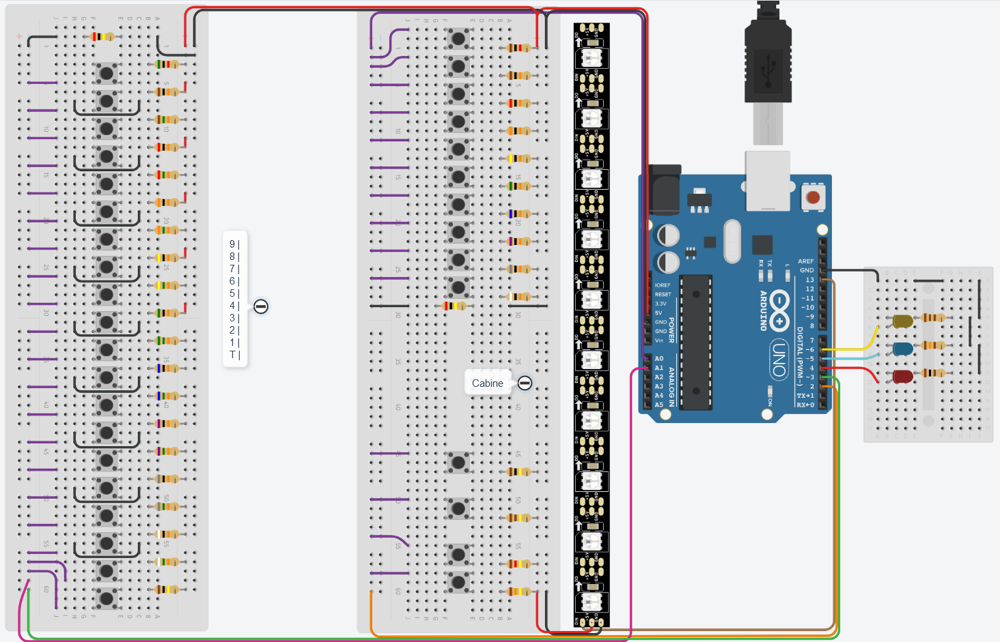

# EXP3_AS02-Elevador
Simulação de um elevador em arduino

**[Enunciado](https://raw.githubusercontent.com/Trabalhos-PUC-PR/EXP3_AS02-Elevador/main/ProjetoElevador.pdf)**, sendo bem honesto, eu nn sei direito oq eles querem exatamente, ent eu só fiz oq eu peguei q era meio obvio q eles queriam e eu dei meu toque

****
```
Clique na imagem para ir para o projeto no tinkercad

Pra facilitar a vida de quem vai reproduzir isso, os resistores de cima são todos de 1kΩ;
Na parte de baixo, eles estão na seguinte ordem:

|  T  | 1°A  | 2°A  | 3°A  | 4°A  | 5°A  | 6°A  | 7°A  | 8°A  | 9°A  | ------ | Porta |Emergnc|  ON   |  OFF  |
| 1kΩ | 10kΩ | 20kΩ | 30kΩ | 40kΩ | 50kΩ | 60kΩ | 70kΩ | 80kΩ | 90kΩ | ------ | 100kΩ | 110kΩ | 120kΩ | 130kΩ |

todos os diodos utilizados são diodos normais

nos botões dos andares, os resistores são incrementados de 5kΩ em 5kΩ, começando em 5kΩ e acabando em 100kΩ
```

<a href="https://www.tinkercad.com/things/hJp3M7OG8Le"></a>

## Referencia:
[Using millis() for timing. A beginners guide](https://forum.arduino.cc/t/using-millis-for-timing-a-beginners-guide/483573)
